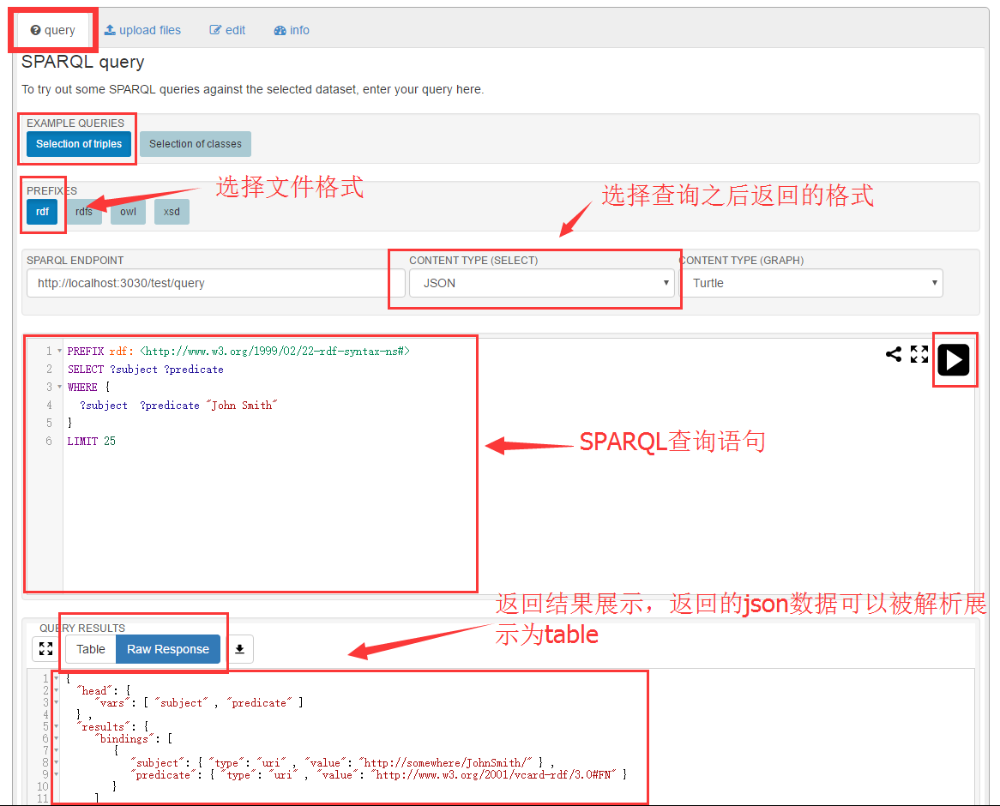

# Fuseki

## 1. 简介

Fuseki是一个HTTP服务器，它主要的作用有

1. 在HTTP的基础上实现了SPARQL通信协议，提供SPARQL的查询远程web服务
2. 内置TDB，可以使用TDB来执行SPARQL查询，获取rdf数据。

## 2. 运行Fuseki

首先要先下载[Fuseki](http://jena.apache.org/download/#apache-jena-fuseki)

然后进行解压，解压之后，文件如下（fuseki v2）


[英文文档地址](http://jena.apache.org/documentation/fuseki2/fuseki-run.html)

### 2.1 命令行运行

在window下，使用命令行运行，只要依赖于两个文件

1. fuseki-server.bat
2. fuseki-server.jar

配置环境的大致步骤为：

1. 将解压后的文件夹路径拷贝，例如d:\\fuseki
2. 配置环境变量，新建一个FUSEKI_HOME = d:\\fuseki
3. 将FUSEKI_HOME添加到PATH的末尾，PATH = ....;%FUSEKI_HOME%
4. 需要在有fuseki-server.jar包的目录下运行（尝试配置了CLASSPATH，但是还是无法运行，会报`Can't find jarfile to run`）

之后，就可以在cmd中，直接运行

```shell
fuseki-server
```

运行之后会在当前目录下创建一个run(FUSEKI_BASE)的文件夹，用于保存运行的实例的各种信息，此外，还可以通过`FUSEKI_BASE/configuration`来配置数据服务。（data service）

在浏览器中输入`localhost:3030`，就可以看到一个配置的页面，


此时，我们需要给其配置一个数据集，才能有进一步的操作，


我们给新建的数据库导入一些数据


根据提示，可以看到可以上传rdf格式的文件作为数据，我们选择了[data/example.rdf](../data/example.rdf)作为数据上传


上传成功后，我们可以在页面上进行查询



### 2.2 以Web应用程序的形式运行

解压的文件中，还提供了一个war包，这就意味着我们可以直接使用tomcat来运行fuseki。因为Fuseki中要求至少支持Servlet 3.0 API，因此至少要求tomcat版本为7或者Jetty 8，并且java 8。

如果在linux下，FUSEKI_BASE默认为/etc/fuseki，需要为这个文件赋予写的权限。

### 2.3 以服务的形式运行

Fuseki可以作为操作系统的一个服务来运行，并且设置开机启动，在解压的文件中有一个fuseki的搅拌，它其实是一个linux的init.d，可以将fuseki配置到开机启动中。

运行时，进程的参数会从`/etc/default/fuseki`包括`FUSEKI_HOME`和`FUSEKI_BASE`中读取。