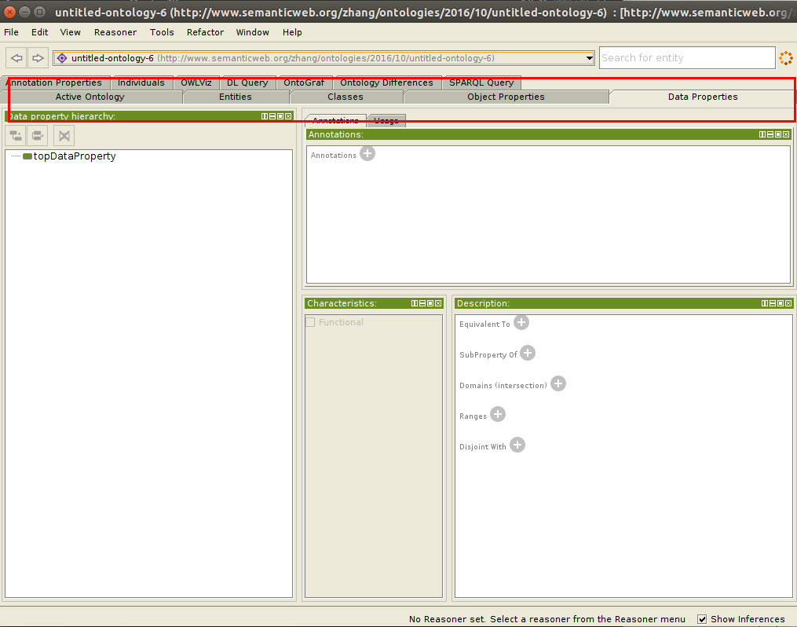
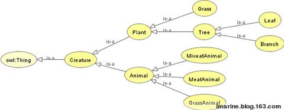
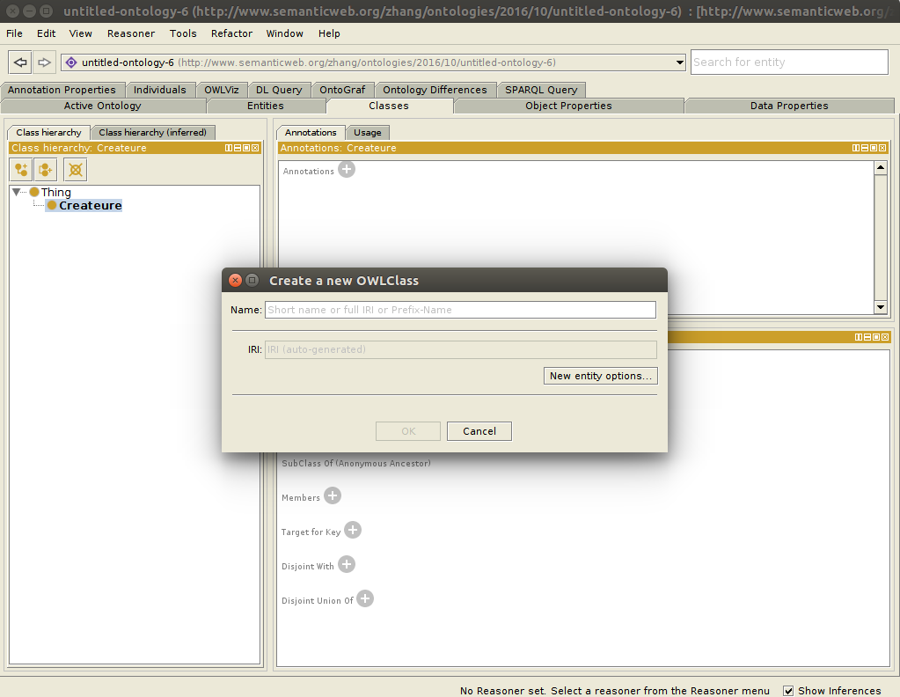
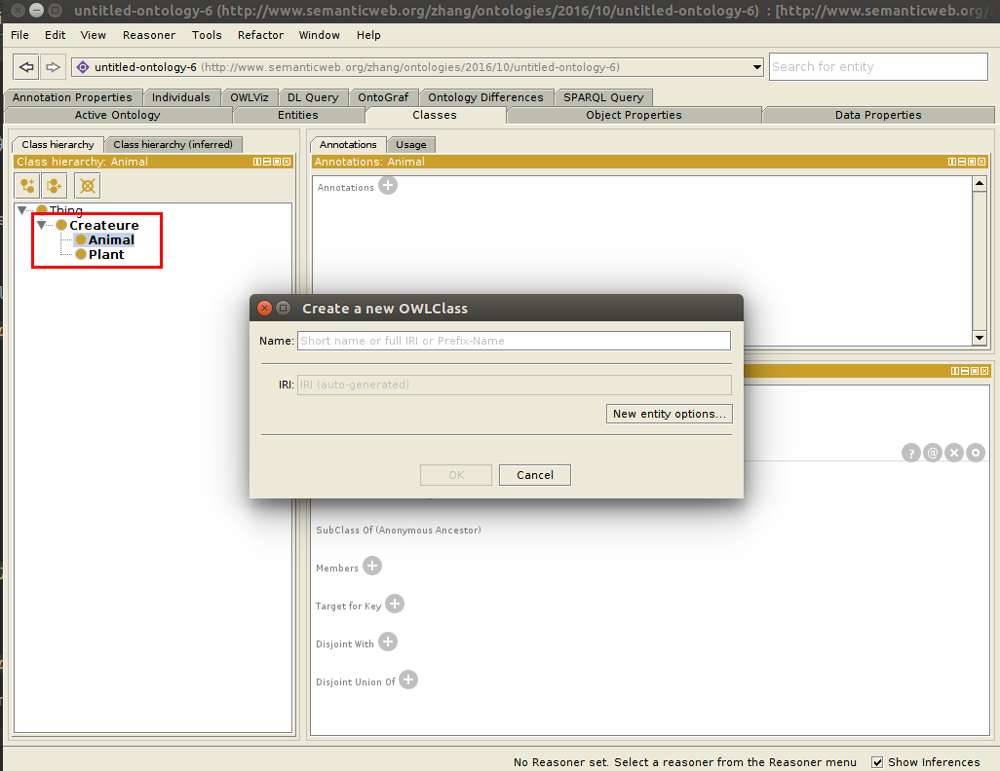
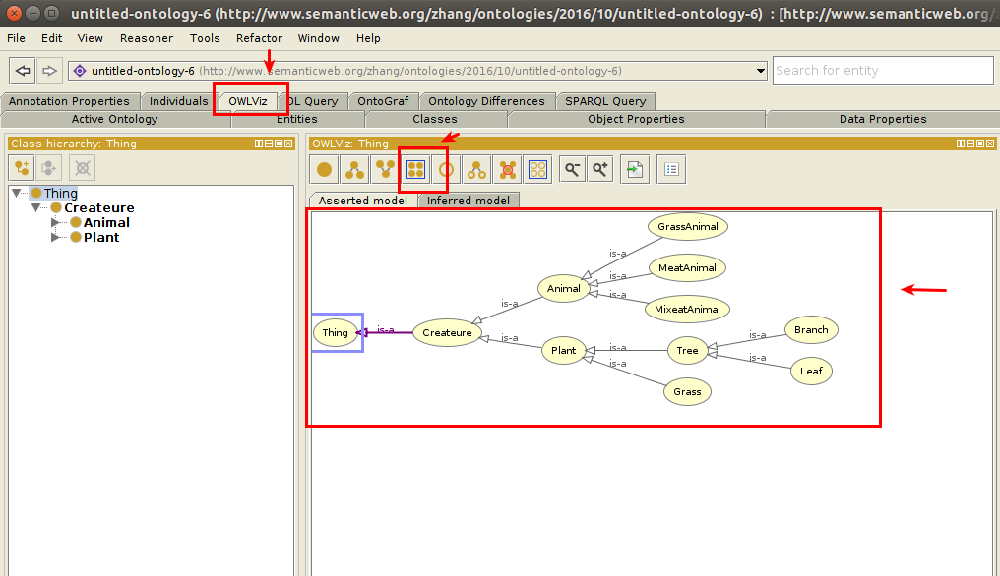
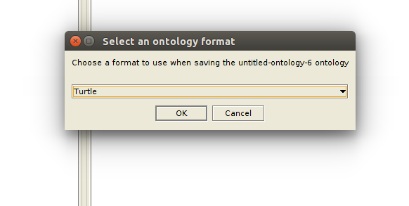

# Protégé

## 1. 概述

Protégé是一个开源智能系统本体编辑和知识获取框架，包括构建框架和本体（ontology）编辑器。

主页：http://protege.stanford.edu/
下载(5.0.0)：http://download.csdn.net/download/loveshouwang/8513995

此外，还要安装一个`graphviz`，可以直接[官网](http://www.graphviz.org/Download_linux_ubuntu.php)上下载。这个的作用是图形化我们所建立的本体。

*官网上不去，只能用别人上传的资源*

在5.0.0版本的，有以下组成部分（跟owl一致）：

* entities 定义简写
* classes 类
* object Properties 对象属性
* data properites 数据属性

## 2. 创建本体

以创建本体`Creature`为例子。

先点击`Classes`，然后在edit->create new，创建一个类`Creature`。这个就是所谓的`Domain Specific root class`.

然后在edit->create child，创建两个Creature的子类Plant和Animal

全部建立完成之后，点击OWLViz，就可以看到整体效果

创建结束之后，我们可以将这个本体导出，在file->save as

我们将这个作为数据，放入到[data](../data)文件夹中，可以作为学习jena的ontology api的数据来源。

