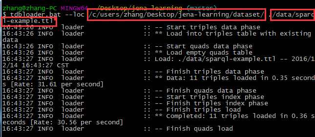
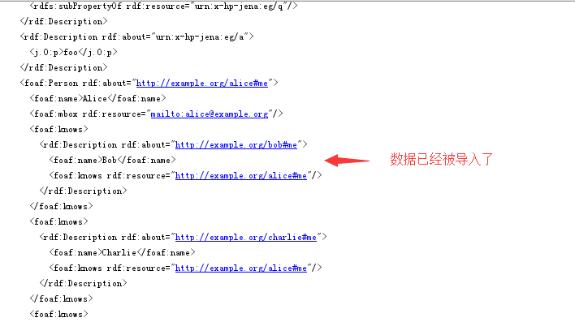

# TDB

## 1. 简介

TDB是Jena框架的一个组成部分，用于存储和检索RDF数据的数据库，它可以用于在`单机`高效地存储RDF。

TDB中提供`事务(transaction)`的机制，可以保证数据安全地进行操作，避免意外地中断造成的数据丢失等问题。

在Fuseki中，内置了TDB进行数据存储和SPARQL的查询。


### 1.1 入门基本操作

1. 构建TDB数据库
2. 连接TDB数据库
3. 进行事务操作


### 1.2 批量导入Bulkloader

我们可以使用`Bulkloader`来批量导入数据，在Jena中提供了命令行工具tdbloader来实现

```shell
tdbloader.bat --loc database[tdb数据库目录] rdfFile[要导入的数据的文件名]
```

运行1.1的示例之后，我们会在根目录下创建一个TDB数据库（dataset目录下），我们使用命令行工具目录下的`sparql-example.ttl`文件数据导入到dataset数据中。




导入之后，再运行1.1示例中的TDBDatasetExample.connect()，打印出数据



我们在数据集上运行查询语句，[完整示例](../tdb/TDBQueryExample.java)

## 2. TDB的设计

### 2.1 概述

TDB将数据集存储在单个目录下的文件系统中，一个数据集包含

1. node table(节点表)，并非传统SQL中的表
2. Triple/Quad indexes(三元组/四元组索引)
3. prefixes table(存储命名空间前缀的表)

### 2.2 The Node Table

`Node Table`实际上是一个字典(dictionary)，提供了`node(节点)`和`nodeid(节点id)`之间的双向映射。

在进行查询的过程中，经常会使用到`nodeid` -> `node`的映射，因此在Node Table的实现上，用来一个缓存来存储这样的结果。？？

NodeId是一个8字节的数字，从Node到Nodeid的映射是基于Node的hash值(128字节的MD5哈希值)

node table的存储是这样的结构

1. 一个顺序的文件映射`nodeId`到`node`
2. 一个B+ tree从映射node到nodeid

### 2.3 Triple and Quad Indexes

三元组用于`default graph`(默认的rdf图)，四元组则是在三元组的基础上多一个一个图的IRI，用于`named graph`(命名的图)，可以用于多图数据检索。

由于在SQL中，并没有`triple table`可以直接存储三元组数据，因此在TDB中，所谓的`triple table`其实是三张表的索引保存在一起。而TDB提供了三张表的管理，暴露在外面的接口可以直接操作三元组。

### 2.4 Prefixes Table

`Prefixes Table`使用了一个`node table`和一个索引(Graph->Prefix->URI)，通常非常地小，且不参与到查询的过程中。

一般来说，只在序列化三元组数据，将其保存为`RDF/XML`或`Turtle`格式的文件中会使用到这个表。

### 2.5 Inline Values

暂时看不懂

### 2.6 Query Processing

TDB提供了一些底层次的图模式的优化，

## 3. TDB 数据集

一个RDF数据集可以是一个未命名的rdf图和零到多个命名的rdf图的集合。默认情况下，是在default graph进行SPARQL查询。

### 3.1 数据集存储

TDB使用文件（目录）来存储数据集。

未命名的rdf graph会被存储为三元组，而命名的rdf graph则会被存储为四元组（即多了一个索引）

通过相同的文件路径(目录)和TDBFactory.createDataset(theSameLoaction)在JVM创建的每个数据集都是相同的。

*在这里看来，TDB应该是一个内存数据库，把所有的数据载入到内存中，再进行计算操作。而所谓的缓存，是利用多余的bit为来加载一些数据。*

### 3.2 数据查询

在查询RDF数据时，命名的rdf graph和default的rdf graph会被区分开来，所有的命名的rdf graph可以被当作一个单独的图（所有的命名图可以进行联合操作）。

### 3.3 特殊的图名称

在TDB中提供

|URI|说明|
|:--|:--|
|urn:x-arq:UnionGraph|查询在RDF数据中所有合并的命名的rdf图|
|urn:x-arq:DefaultGraph|数据集默认的rdf图，使用这个URI时，意味着查询默认的图是一个`union graph`|

## 3. TDB Java API

### 2.1 连接数据集

`TDBFactroy`类中包含了静态的工厂方法，可以用于连接数据集，在使用之后可以关闭连接之后，所有的更新操作会被保存到硬盘中。

数据集可以以两种方式提供

1. 目录路径
2. assembler文件

#### 2.1.1 使用目录路径

使用这种方式，当提供的目录为空时，TDB 会建立文件的索引和node table(节点表格)。在存在数据的情况下，TDB会直接连接到已存在数据。

```java
// 创建一个TDB支撑的数据集
String directory = "MyDatabases/Dataset1";
Dataset dataset = TDBFactory.createDataset(directory);

```


#### 2.1.2 使用assembler文件

## 5. 事务

### 5.1 事务简介

TDB使用`write-ahead-logging`的机制来支持`ACID事务`。

通过事务可以提高TDB数据库的健壮性。

TDB事务可以同时支持一个写事务操作和多个读事务。

### 5.2 不足

1. Bulk loads : TDB的bulk loader不支持事务
2. 不支持嵌套的事务
3. Some active transaction state is held exclusively in-memory, limiting scalability.
4. Long-running transactions. Read-transactions cause a build-up of pending changes;

### 5.3 事务API

#### 5.3.1 读事务

基本语法

```java
dataset.begin(ReadWrite.READ);
try {
  // 进行读操作
} finally {
    dataset.end();
}
```

使用`dataset.begin(ReadWrite.READ)`开始一个读事务，然后使用一个`dataset.end()`来表明一个事务的结束。

此外，也可以使用`data.commit()`或`dataset.abort()`来结束一个事务。

#### 5.3.2 写事务

写事务可以用于SPARQL查询、SPARQL更新操作和任何修改数据的行为。

注意`model.read`操作会消耗大量临时的空间。

基本模式为

```java
dataset.begin(ReadWrite.WRITE);
try{
    //
    dataset.commit();
} finally {
    dataset.end();
}
```

## 6. 多线程使用

多线程共享rdf数据有两种模式

1. 一个数据集对象，在两个线程中使用。
2. 不同线程共享存储，分别创建自己的数据集对象，有独立的事务操作。

### 6.1 模式1示例

有一个全局的数据集对象

```java
Dataset dataset = TDBFactory.createDataset(location);
```

有两个线程thread1和thread2共享这个数据集对象，

thread1

```java
dataset.begin(ReadWrite.WRITE);
try {
   //
   dataset.commit()
} finally {
    dataset.end();
}
```
   
thread2

```java
dataset.begin(ReadWrite.READ);
try {
   //
} finally {dataset.end();}
``` 
    
### 6.2 模式2示例
 
在各自的线程上，对同一个数据创建各自的数据集对象`Dataset dataset`，拥有各自的事务。
 
thread1

```java
Dataset dataset = TDBFactory.createDataset(location);
dataset.begin(ReadWrite.WRITE);
try {
 // ..
 dataset.commit();
} finally {dataset.end();}
```

thread2

```java
Dataset dataset = TDBFactory.createDataset(location);
dataset.begin(ReadWrite.READ);
try {
 // ...
} finally {
    dataset.end();
}
```

## 7. 多个JVM

在不同JVM运行的应用程序不能同时共享同一份数据文件（高危，有很大机率会损坏数据）。


