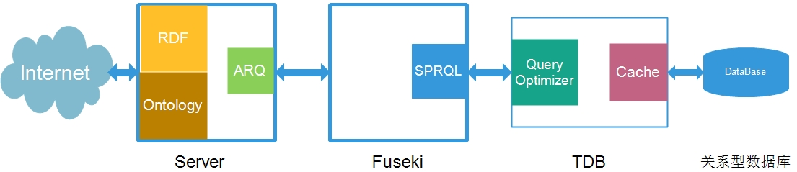

# Jena 学习

## Jena总体结构

## 概述

1. [rdf](./notes/rdf.md)

    * [rdf graph](./notes/rdf-graph.md)

2. notes.ontology

    * [owl](./notes/owl.md)

3. ARQ
4. [Fuseki](./notes/fuseki.md)
5. [SPARQL](./notes/sparql.md)

    * [w3c sparql query 2013文档翻译](./notes/sparql/)

6. [TDB](./notes/tdb.md)

    * [TDB Assembler](./notes/tdb-assember.md)
    * [TDB Dynamic Datasets](./notes/tdb-dynamic-dataset.md)

## Jena的整体web流程框架

## 学习资料汇总

1. [Jena官网](http://jena.apache.org/index.html)
2. [sparql](https://www.w3.org/TR/sparql11-query/)
3. [如何在ecplise中使用Jena](http://www.iandickinson.me.uk/articles/jena-eclipse-helloworld/)
4. [Jena资料整理博客](http://www.itdadao.com/tags/jena-0.html)
5. [Jena API文档](http://jena.apache.org/documentation/javadoc/jena/)
6. [OWL](https://www.w3.org/TR/2004/REC-owl-features-20040210/)
7. [owl本体语言学习笔记](http://blog.sina.com.cn/s/blog_6a7447840100utms.html)

2016-10-21