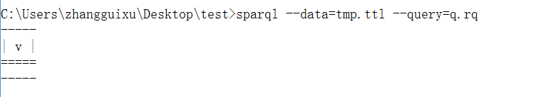
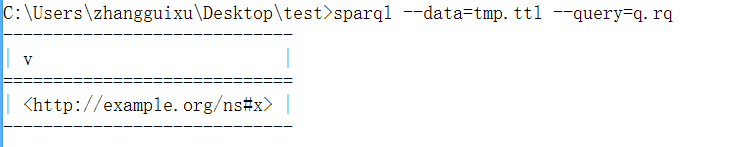
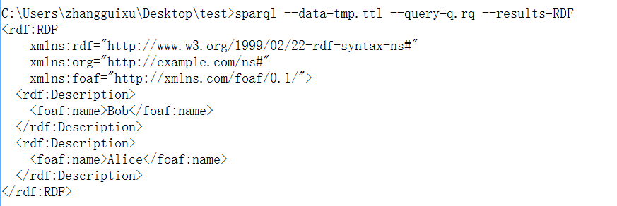

# SPARQL 1.1 Query Language

W3C Recommendation 21 March 2013

[原文地址](https://www.w3.org/TR/sparql11-query/)

## 2. 入门（简单示例）

在绝多数`SPARQL`查询语句中都包含一系列的三元组（匹配）模式，这些被叫做基本图匹配模式(basis graph pattern)。三元组模式跟RDF的三元组很类似，不同的是，在三元组模式中，主体、谓词、客体都有可能是一个变量。一个基本的图模式会去匹配RDF数据的子图。

### 2.1 简单的查询示例

示例，有以下数据：

```
<http://example.org/book/book1> <http://purl.org/dc/elements/1.1/title> "SPARQL Tutorial" .
```

查询语句

```
SELECT ?title
WHERE
{
    <http://example.org/book/book1> <http://purl.org/dc/elements/1.1/title> ?title .
}
```

查询结果为：


## 2.2 多重匹配查询

我们根据查询条件，对数据进行序列处理(solution sequence，在后面还有更加详尽的解释)，匹配出所符合条件的数据。

```
@prefix foaf:  <http://xmlns.com/foaf/0.1/> .

_:a  foaf:name   "Johnny Lee Outlaw" .
_:a  foaf:mbox   <mailto:jlow@example.com> .
_:b  foaf:name   "Peter Goodguy" .
_:b  foaf:mbox   <mailto:peter@example.org> .
_:c  foaf:mbox   <mailto:carol@example.org> .
```

查询语句

```
PREFIX foaf: <http://xmlns.com/foaf/0.1/>
SELECT ?name ?mbox
WHERE
{
    ?x foaf:name ?name .
    ?x foaf:mbox ?mbox .
}
```

按照本人的理解，应该就是先按照条件匹配`?x foaf:name ?name`，然后在匹配其中有`?x foaf:mbox ?mbox`，这样一个顺序，最后查询出符合条件的所有结果。


### 2.3 匹配RDF Literals

这就是匹配客体上的字符串数据，有示例数据

```
@prefix dt:   <http://example.org/datatype#> .
@prefix ns:   <http://example.org/ns#> .
@prefix :     <http://example.org/ns#> .
@prefix xsd:  <http://www.w3.org/2001/XMLSchema#> .

:x   ns:p     "cat"@en .
:y   ns:p     "42"^^xsd:integer .
:z   ns:p     "abc"^^dt:specialDatatype .
```

#### 2.3.1 通过语言来匹配

在查询语句中，可以使用`@+语言标签`指定语言，[语言标签](http://www.rfc-editor.org/rfc/bcp/bcp47.txt)，例如在示例数据中，就使用`@en`来指定`cat`为英文。在查询时，如果不加上`cat@en`，以下查询是没有结果的。

```
SELECT ?v
WHERE
{
    ?v ?p "cat"
}
```



必须修改为

```
SELECT ?v
WHERE
{
    ?v ?p "cat"@en
}
```



#### 2.3.2 匹配数字类型

在查询中，已经默认了数字类型为`xsd:`定义的数字类型，有

* xsd:integer
* xsd:float
* xsd:double

```
SELECT ?v
WHERE
{
    ?v ?p 42
}
```

查询结果为


#### 2.3.3 匹配自定义类型

如果需要匹配自定义类型，那么就需要在查询的时候加入自定义类型的定义，例如在示例数据中查询`z`的数据，就必须跟上自定义类型的定义空间。

```
SELECT ?v
WHERE
{
    ?v ?p "abc"^^<http://example.org/datatype#specialDatatype> .
}
```


### 2.4 空节点

查询的结果是可以包含空节点的。在示例的数据中，空节点即`_:`，也可以什么都不写，就只有一个`:`，后面跟着的`a`或`b`则是空节点的标签。需要注意的是空节点的标签并`没有具体的含义`，只是拿来区别两个空节点而已，可以任意修改。

```
@prefix foaf:  <http://xmlns.com/foaf/0.1/> .

_:a  foaf:name   "Alice" .
_:b  foaf:name   "Bob" .
```

空节点标签会被包括在返回的结果中，在一个结果集里面，使用相同的空节点标签代表同一个空白节点。（在不同结果集里面，则是没有任何联系的）

例如我们对数据进行查询，

```
PREFIX foaf: <http://xmlns.com/foaf/0.1/>
SELECT ?x ?name
WHERE
{
    ?x foaf:name ?name .
}
```


*由于标签是没有含义的，仅仅作为标识使用，因此标签不能作为查询中的条件来使用*

### 2.5 表达式创建值(Creating Values with Expressions)

在SPARQL中，允许我们通过复杂的表示式来创建值。

这里的`表达式(Expression)`可以说是内置的函数，例如`CONCAT`函数等，[表示式列表](https://www.w3.org/TR/sparql11-query/#selectExpressions)

我们通过一个示例来看如何在SELECT中运用表达式。

```
@prefix foaf:  <http://xmlns.com/foaf/0.1/> .

_:a  foaf:givenName   "John" .
_:a  foaf:surname  "Doe" .
```

我们通过查询，将结果合成一个完整的姓名返回。

```
PREFIX foaf: <http://xmlns.com/foaf/0.1/>
SELECT ?name
WHERE
{
    ?x foaf:givenName ?G ;
        foaf:surname ?S .
    BIND(CONCAT(?G, " ", ?S) AS ?name)
}
```


### 2.6 (查询结果)建立RDF图(RDF Graphs)

在SPARQL中，CONSTRUCT查询可以返回一个rdf图。这个图是基于生成RDF三元组的模版和查询匹配结果进行建立的。

*SELECT查询返回的变量绑定(variable bindings)。只能意会一下了。*

示例：

```
@prefix org:    <http://example.com/ns#> .

_:a  org:employeeName   "Alice" .
_:a  org:employeeId     12345 .

_:b  org:employeeName   "Bob" .
_:b  org:employeeId     67890 .
```

查询语句

```
PREFIX org: <http://example.com/ns#>
PREFIX foaf: <http://xmlns.com/foaf/0.1/>

CONSTRUCT {
    ?x foaf:name ?name
} WHERE {
    ?x org:employeeName ?name
}
```


这个结果可以被序列化为RDF/XML文件，我们通过加一个参数来`--result=RDF`来将查询结果序列化成rdf graph。

