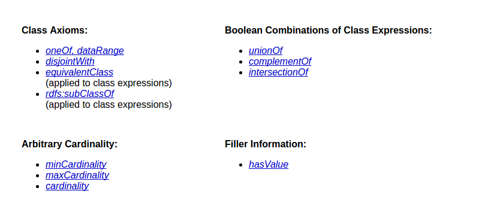

# OWL简介

## 1. 概述

[owl](https://www.w3.org/TR/2004/REC-owl-features-20040210/)

OWL是一种本体描述语言，用于描述文档的信息供应用程序理解和使用。它能够明确地表示一个术语（term）的意义和术语之间的关系。

`本体（notes.ontology）`指的就是这些术语的表示和术语之间的关系。

### 1.1 OWL的子语言

OWL提供三种子语言（语言表达能力逐渐增强）：

* OWL Lite支持初级的层级分类和简单约束条件。
* OWL DL支持可计算表达式约束
* OWL Full支持表达式，还支持语法。

这三种子语言是包含关系，分别是OWL Full>OWL DL>OWL Lite，OWL Full是最大的集合。

### 1.2 OWL Lite纲要

OWL Lite主要包含以下关系描述：


可以看到这些关系术语都是很贴近计算机编程的，例如类、属性、数据类型等等。

### 1.3 OWL DL和OWL Full纲要



## 2. OWL Lite的术语描述

简介关系描述的具体含义

TBD).

## 2. 本体描述文件

[owl guide](https://www.w3.org/TR/owl-guide/)

### 2.1 命名空间（Namespace）

在我们使用术语之前，我们需要通过命名空间来指定本体使用了哪些词汇。一个典型的本体描述文件都会以命名空间声明开头。

```xml
<rdf:RDF 
    xmlns     ="http://www.w3.org/TR/2004/REC-owl-guide-20040210/wine#" 
    xmlns:vin ="http://www.w3.org/TR/2004/REC-owl-guide-20040210/wine#"       
    xml:base  ="http://www.w3.org/TR/2004/REC-owl-guide-20040210/wine#"       
    xmlns:food="http://www.w3.org/TR/2004/REC-owl-guide-20040210/food#"    
    xmlns:owl ="http://www.w3.org/2002/07/owl#"
    xmlns:rdf ="http://www.w3.org/1999/02/22-rdf-syntax-ns#"
    xmlns:rdfs="http://www.w3.org/2000/01/rdf-schema#"
    xmlns:xsd ="http://www.w3.org/2001/XMLSchema#">
</rdf:RDF>
```


