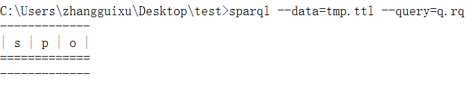
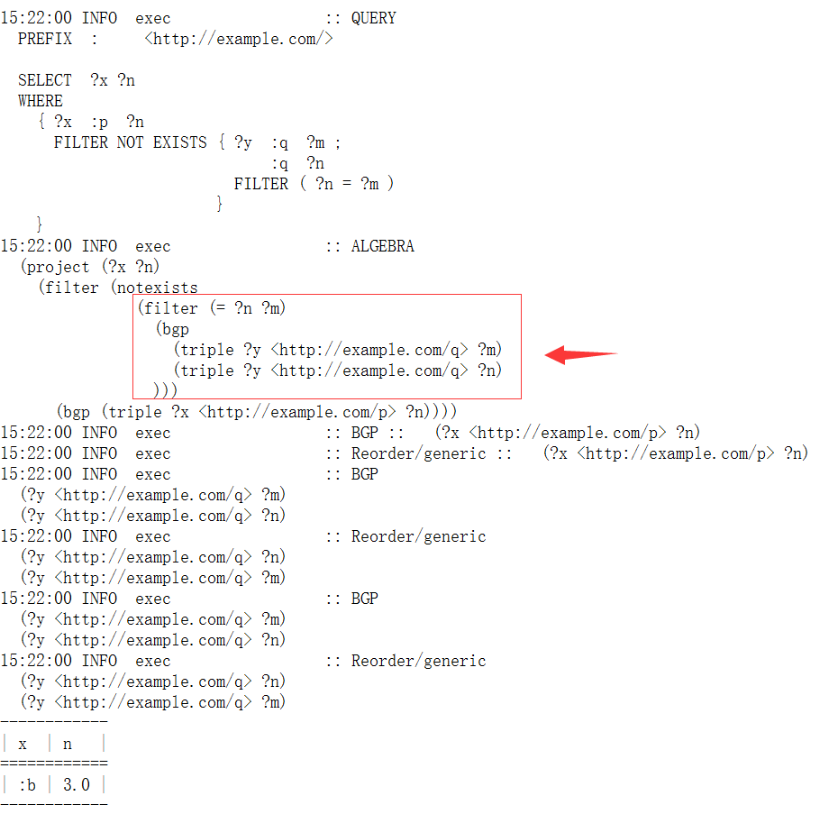

# SPARQL 1.1 Query Language

W3C Recommendation 21 March 2013

[原文地址](https://www.w3.org/TR/sparql11-query/)

## 6. 否定过滤器(Negation)

### 6.1 使用图模式进行过滤

在SPARQL中，我们可以通过关键字`FILTER EXISTS`+{}或`FILTER NOT EXISTS`+{}的方式来对结果集进行过滤。

*{}表示图模式*

举个例子

```
@prefix  :       <http://example/> .
@prefix  rdf:    <http://www.w3.org/1999/02/22-rdf-syntax-ns#> .
@prefix  foaf:   <http://xmlns.com/foaf/0.1/> .

:alice  rdf:type   foaf:Person .
:alice  foaf:name  "Alice" .
:bob    rdf:type   foaf:Person .
```

使用图模式去除存在`foaf:name`属性的三元组。

```
PREFIX foaf: <http://xmlns.com/foaf/0.1/>
PREFIX rdf: <http://www.w3.org/1999/02/22-rdf-syntax-ns#>

SELECT ?person
WHERE {
    ?person rdf:type foaf:Person .
    FILTER NOT EXISTS {
        ?person foaf:name ?name .
    }
}
```


使用图模式筛选出存在`foaf:name`属性的三元组，

```
PREFIX foaf: <http://xmlns.com/foaf/0.1/>
PREFIX rdf: <http://www.w3.org/1999/02/22-rdf-syntax-ns#>

SELECT ?person
WHERE {
    ?person rdf:type foaf:Person .
    FILTER EXISTS {
        ?person foaf:name ?name .
    }
}
```

其实这样写就等价于

```
PREFIX foaf: <http://xmlns.com/foaf/0.1/>
PREFIX rdf: <http://www.w3.org/1999/02/22-rdf-syntax-ns#>

SELECT ?person
WHERE {
    ?person rdf:type foaf:Person .
    ?person foaf:name ?name .
}
```


### 6.2 去除可能的结果集

在SPARQL中，可以通过关键字`MINUS`来进行条件过滤。还是以上面的例子作为数据，我们可以编写出跟使用`FILTER NOT EXISTS`一样结果的查询语句：

```
PREFIX foaf: <http://xmlns.com/foaf/0.1/>
PREFIX rdf: <http://www.w3.org/1999/02/22-rdf-syntax-ns#>

SELECT ?person
WHERE {
    ?person rdf:type foaf:Person .
    MINUS {
        ?person foaf:name ?name .
    }
}
```

查询结果还是一样的


### 6.3 NOT EXISTS vs MINUS

在SPARQL提供了这两种否定过滤器（可以这样理解），从上面例子来看，两者其实很类似。这一节也是来说明两种细微的差别，从而加深对两种方式的理解。

它们的区别在于：MINUS语句块中的变量是与匹配模式的作用域是相同的，也就是说`变量共享`，而NOT EXISTS的作用域则是分隔开来的。

还是通过几个例子来说明吧：

```
@prefix : <http://example/> .
:a :b :c .
```

NOT EXISTS的方式来查询

```
SELECT *
WHERE {
    ?s ?p ?o .
    FILTER NOT EXISTS {
        ?x ?y ?z
    }
}
```



这个查询大致的过程是`?s ?p ?o`模式对数据进行匹配，然后再进行`?x ?y ?z`的模式匹配，去除交集，剩下的数据就为空。

而MINUS则不同，

```
SELECT *
WHERE {
    ?s ?p ?o .
    MINUS {
        ?x ?y ?z
    }
}
```

查询的大致过程是`?s ?p ?o`模式对数据进行匹配，之后在此数据集中，进行二次匹配，由于变量相关，即`?s ?p ?o`都指定了匹配的变量，而本例子中使用`?x ?y ?z`跟上面的三元组模式没有共同的变量，应该匹配为空，或者说无法进行预期的匹配。

为了验证我们的想法，我们对MINUS的查询稍作修改。

```
SELECT * 
WHERE {
    ?s ?p ?o .
    MINUS {
        ?s ?p ?x .
    }
}
```

这个时候，由于`?s ?p ?x`可以匹配到`?s ?p ?o`匹配到所有结果，那么结果集就应该为空，执行结果如下：


我们再拿上一个数据示例来分析。我们将MINUS中的查询语句做一点小修改就可以看到结果的不同。

```
PREFIX foaf: <http://xmlns.com/foaf/0.1/>
PREFIX rdf: <http://www.w3.org/1999/02/22-rdf-syntax-ns#>

SELECT ?person
WHERE {
    ?person rdf:type foaf:Person .
    MINUS {
        ?p foaf:name ?name .
    }
}
```

注意到，我们把MINUS语句块中的`?person`改成了`?p`这个时候，就由于两个匹配模式没有`共同的变量`，导致查询结果为：


关于这一部分的理解，我们可以通过

### 6.4 内部的FILTER

我们再来讨论一个更加复杂的情况，那就是在NOT EXISTS和MINUS语句块加入`FILTER`的情况，来加深对变量的作用域，共享问题的理解。

举个例子，来看看两者的区别。

```
@prefix : <http://example.com/> .
:a :p 1 .
:a :q 1 .
:a :q 2 .

:b :p 3.0 .
:b :q 4.0 .
:b :q 5.0 .
```

*官方文档这部分经本人实验，是错误的*

使用FILTER NOT EXISTS，会把作用域进行切割，我们可以通过`--debug`清晰地看到查询语句执行的结果：

```
PREFIX : <http://example.com/>
SELECT *
WHERE {
    ?x :p ?n .
    FILTER NOT EXISTS {
        ?x :q ?m .
        FILTER(?n = ?m)
    }
}
```


可以看到以下的结构

```
(
    sequence
        (
            filter (
                    notexists
                    (table empty)
                    )
            (table unit)
        )
   (
       bgp (triple ?x <http://example.com/p> ?n)
   )
)
```

也就是说查询时，在FILTER NOT EXISTS中的?n其实是不存在的，导致查询结果为空，因此最终结果为`:a`和`:b`

要想达到官网的结果，应该将查询语句改为：

```
// 如果要达到所预期的查询效果应该是这样
PREFIX : <http://example.com/>
SELECT ?x ?n
WHERE {
    ?x :p ?n .
    FILTER NOT EXISTS {
        ?y :q ?m .
        ?y :q ?n .
        FILTER(?n = ?m)
    }
}
```



那么在MINUS中，是什么情况？我们来看看官网上的例子执行的具体过程。

```
PREFIX : <http://example.com/>
SELECT *
WHERE {
    ?x :p ?n
    MINUS {
        ?x :q ?m .
        FILTER(?n = ?m)
    }
}
```


总结一下：

**无论是MINUS还是FILTER NOT EXISTS中，FILTER都不能获取语句块外部的变量，由于本人使用的JENA中的一个SPARQL命令行工具，所以暂时不清楚是一个bug，还是标准文档中描述有错误。**

